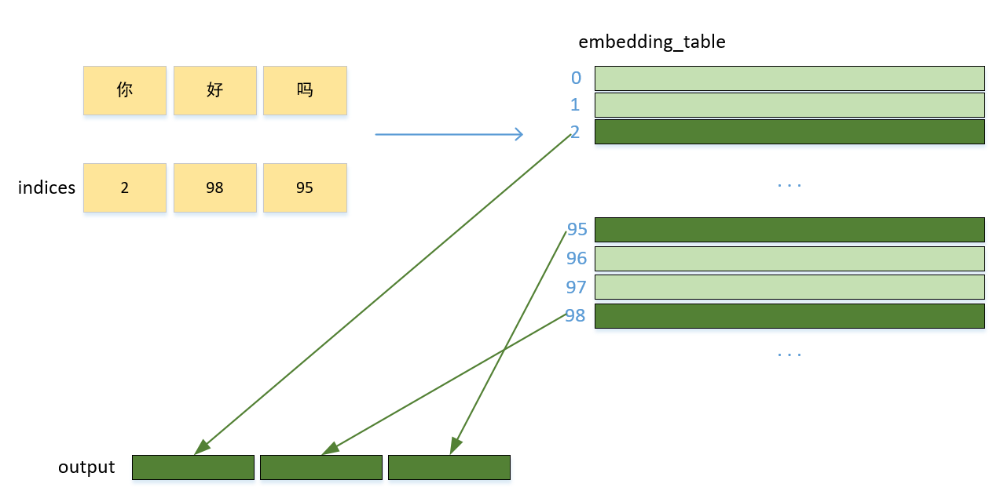

# embedding 的计算



假设输入是["你", "好", "吗"]，其indices为[2, 98, 95]。
embedding_table 是一个维度为 V x D 的矩阵，其中V指词表大小，D指嵌入维度。
embedding 就是用 indices 中的每个数，去 embedding_table 取对应的向量。


我的kernel实现是：
```
__global__ void embedding_f32_kernel(const int *indices, float *embedding_table,
                                     float *output, int num_indices, int emb_size) {    
    int idx = blockIdx.x * blockDim.x + threadIdx.x;
    if(idx < num_indices){
        int emb_idx = indices[idx];
        float* emb_ptr = embedding_table + emb_idx * emb_size;
        for(int i = 0; i < emb_size; i++){
            output[idx * emb_size + i] = emb_ptr[i];
        }
    }
}
```

对比`示例`中的实现：
```
__global__ void embedding_f32_kernel(const int *indices, float *embedding_table,
                                     float *output, int num_indices, int emb_size) {
    int idx = blockIdx.x * blockDim.x + threadIdx.x;
    int offset = indices[blockIdx.x] * emb_size;

    output[blockIdx.x * emb_size + threadIdx.x] = embedding_table[offset + threadIdx.x];
}
```

embedding 这个kernel 其输入输出矩阵size不一致，更能够让我们学习kernel 中 idx 的对应关系  
1、我的实现中，一个thread 有 emb_size 个赋值操作， 而示例中，一个 thread 赋值一次  
2、blockIdx.x * blockDim.x + threadIdx.x; 对应着输出的数据的索引

在本例中，假定一个block计算 indices 中的一个元素。

# benchmark
--------------------------------------------------------------------------------------------------------------
                                             MaxV=1024, SeqLen=2048, EmbSize=512
                out_f32: ['-1.75253558 ', '0.18378104  ', '0.14859383  '], time:0.012541ms
              out_f32x4: ['-1.75253558 ', '0.18378104  ', '0.14859383  '], time:0.015652ms
         out_f32x4_pack: ['-1.75253558 ', '0.18378104  ', '0.14859383  '], time:0.010097ms
             out_f32_th: ['-1.75253558 ', '0.18378104  ', '0.14859383  '], time:0.019455ms
--------------------------------------------------------------------------------------------------------------
                out_f16: ['-1.24902344 ', '-2.02148438 ', '-0.5390625  '], time:0.010741ms
              out_f16x8: ['-1.24902344 ', '-2.02148438 ', '-0.5390625  '], time:0.015438ms
         out_f16x8_pack: ['-1.24902344 ', '-2.02148438 ', '-0.5390625  '], time:0.009406ms
             out_f16_th: ['-1.24902344 ', '-2.02148438 ', '-0.5390625  '], time:0.020230ms
--------------------------------------------------------------------------------------------------------------
--------------------------------------------------------------------------------------------------------------
                                             MaxV=1024, SeqLen=2048, EmbSize=1024
                out_f32: ['0.52700347  ', '1.46543884  ', '1.36255622  '], time:0.014579ms
              out_f32x4: ['0.52700347  ', '1.46543884  ', '1.36255622  '], time:0.022686ms
         out_f32x4_pack: ['0.52700347  ', '1.46543884  ', '1.36255622  '], time:0.011528ms
             out_f32_th: ['0.52700347  ', '1.46543884  ', '1.36255622  '], time:0.050032ms
--------------------------------------------------------------------------------------------------------------
                out_f16: ['-0.70214844 ', '-0.45825195 ', '-2.0234375  '], time:0.014174ms
              out_f16x8: ['-0.70214844 ', '-0.45825195 ', '-2.0234375  '], time:0.023615ms
         out_f16x8_pack: ['-0.70214844 ', '-0.45825195 ', '-2.0234375  '], time:0.009453ms
             out_f16_th: ['-0.70214844 ', '-0.45825195 ', '-2.0234375  '], time:0.024772ms
--------------------------------------------------------------------------------------------------------------
--------------------------------------------------------------------------------------------------------------
                                             MaxV=1024, SeqLen=4096, EmbSize=512
                out_f32: ['1.6605376   ', '0.00156389  ', '0.36164925  '], time:0.013065ms
              out_f32x4: ['1.6605376   ', '0.00156389  ', '0.36164925  '], time:0.022769ms
         out_f32x4_pack: ['1.6605376   ', '0.00156389  ', '0.36164925  '], time:0.011432ms
             out_f32_th: ['1.6605376   ', '0.00156389  ', '0.36164925  '], time:0.024605ms
--------------------------------------------------------------------------------------------------------------
                out_f16: ['-0.02931213 ', '0.57421875  ', '-0.2734375  '], time:0.013018ms
              out_f16x8: ['-0.02931213 ', '0.57421875  ', '-0.2734375  '], time:0.023139ms
         out_f16x8_pack: ['-0.02931213 ', '0.57421875  ', '-0.2734375  '], time:0.010443ms
             out_f16_th: ['-0.02931213 ', '0.57421875  ', '-0.2734375  '], time:0.024104ms
--------------------------------------------------------------------------------------------------------------
--------------------------------------------------------------------------------------------------------------
                                             MaxV=1024, SeqLen=4096, EmbSize=1024
                out_f32: ['-0.5330283  ', '-0.76414812 ', '-0.83304381 '], time:0.020611ms
              out_f32x4: ['-0.5330283  ', '-0.76414812 ', '-0.83304381 '], time:0.037158ms
         out_f32x4_pack: ['-0.5330283  ', '-0.76414812 ', '-0.83304381 '], time:0.014746ms
             out_f32_th: ['-0.5330283  ', '-0.76414812 ', '-0.83304381 '], time:0.041509ms
--------------------------------------------------------------------------------------------------------------
                out_f16: ['-0.4128418  ', '0.76757812  ', '0.31982422  '], time:0.051260ms
              out_f16x8: ['-0.4128418  ', '0.76757812  ', '0.31982422  '], time:0.037658ms
         out_f16x8_pack: ['-0.4128418  ', '0.76757812  ', '0.31982422  '], time:0.011587ms
             out_f16_th: ['-0.4128418  ', '0.76757812  ', '0.31982422  '], time:0.033653ms
--------------------------------------------------------------------------------------------------------------
--------------------------------------------------------------------------------------------------------------
                                             MaxV=4096, SeqLen=2048, EmbSize=512
                out_f32: ['-0.3423374  ', '-0.36775577 ', '1.48590577  '], time:0.010574ms
              out_f32x4: ['-0.3423374  ', '-0.36775577 ', '1.48590577  '], time:0.015485ms
         out_f32x4_pack: ['-0.3423374  ', '-0.36775577 ', '1.48590577  '], time:0.010180ms
             out_f32_th: ['-0.3423374  ', '-0.36775577 ', '1.48590577  '], time:0.018978ms
--------------------------------------------------------------------------------------------------------------
                out_f16: ['-0.112854   ', '-0.32861328 ', '1.52539062  '], time:0.009882ms
              out_f16x8: ['-0.112854   ', '-0.32861328 ', '1.52539062  '], time:0.015736ms
         out_f16x8_pack: ['-0.112854   ', '-0.32861328 ', '1.52539062  '], time:0.009334ms
             out_f16_th: ['-0.112854   ', '-0.32861328 ', '1.52539062  '], time:0.019586ms
--------------------------------------------------------------------------------------------------------------
--------------------------------------------------------------------------------------------------------------
                                             MaxV=4096, SeqLen=2048, EmbSize=1024
                out_f32: ['1.31334853  ', '0.24159978  ', '1.34659564  '], time:0.014377ms
              out_f32x4: ['1.31334853  ', '0.24159978  ', '1.34659564  '], time:0.022292ms
         out_f32x4_pack: ['1.31334853  ', '0.24159978  ', '1.34659564  '], time:0.011468ms
             out_f32_th: ['1.31334853  ', '0.24159978  ', '1.34659564  '], time:0.024474ms
--------------------------------------------------------------------------------------------------------------
                out_f16: ['-1.42285156 ', '1.76757812  ', '-0.35717773 '], time:0.014174ms
              out_f16x8: ['-1.42285156 ', '1.76757812  ', '-0.35717773 '], time:0.024068ms
         out_f16x8_pack: ['-1.42285156 ', '1.76757812  ', '-0.35717773 '], time:0.009942ms
             out_f16_th: ['-1.42285156 ', '1.76757812  ', '-0.35717773 '], time:0.024199ms
--------------------------------------------------------------------------------------------------------------
--------------------------------------------------------------------------------------------------------------
                                             MaxV=4096, SeqLen=4096, EmbSize=512
                out_f32: ['-0.23316899 ', '0.83636677  ', '-0.56657618 '], time:0.014472ms
              out_f32x4: ['-0.23316899 ', '0.83636677  ', '-0.56657618 '], time:0.022805ms
         out_f32x4_pack: ['-0.23316899 ', '0.83636677  ', '-0.56657618 '], time:0.011122ms
             out_f32_th: ['-0.23316899 ', '0.83636677  ', '-0.56657618 '], time:0.024617ms
--------------------------------------------------------------------------------------------------------------
                out_f16: ['-1.20214844 ', '-0.1262207  ', '-0.22558594 '], time:0.012934ms
              out_f16x8: ['-1.20214844 ', '-0.1262207  ', '-0.22558594 '], time:0.023222ms
         out_f16x8_pack: ['-1.20214844 ', '-0.1262207  ', '-0.22558594 '], time:0.010419ms
             out_f16_th: ['-1.20214844 ', '-0.1262207  ', '-0.22558594 '], time:0.024140ms
--------------------------------------------------------------------------------------------------------------
--------------------------------------------------------------------------------------------------------------
                                             MaxV=4096, SeqLen=4096, EmbSize=1024
                out_f32: ['-0.59071326 ', '-1.17344892 ', '-0.620287   '], time:0.021040ms
              out_f32x4: ['-0.59071326 ', '-1.17344892 ', '-0.620287   '], time:0.037014ms
         out_f32x4_pack: ['-0.59071326 ', '-1.17344892 ', '-0.620287   '], time:0.014782ms
             out_f32_th: ['-0.59071326 ', '-1.17344892 ', '-0.620287   '], time:0.049794ms
--------------------------------------------------------------------------------------------------------------
                out_f16: ['-0.89990234 ', '-0.76806641 ', '0.05389404  '], time:0.020838ms
              out_f16x8: ['-0.89990234 ', '-0.76806641 ', '0.05389404  '], time:0.037527ms
         out_f16x8_pack: ['-0.89990234 ', '-0.76806641 ', '0.05389404  '], time:0.011444ms
             out_f16_th: ['-0.89990234 ', '-0.76806641 ', '0.05389404  '], time:0.033212ms
--------------------------------------------------------------------------------------------------------------