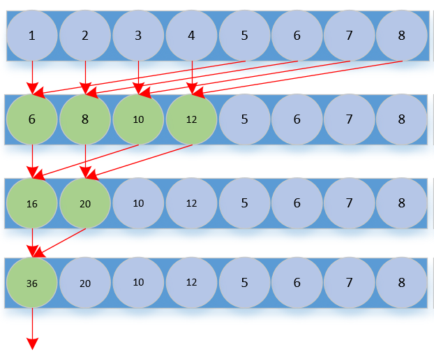

# 一、Reduce kernel 总览
- warp_reduce_fp32/fp16/bf16_kernel
- block_reduce_fp32_kernel
- block_all_reduce_sum_f32_f32_kernel
- block_all_reduce_sum_f32x4_f32_kernel(float4向量化版本)
- block_all_reduce_sum_f16_f16_kernel(fp16版本，使用fp16 acc)
- block_all_reduce_sum_f16_f32_kernel(fp16版本，使用fp32 acc)
- block_all_reduce_sum_f16x2_f16_kernel(fp16向量化版本，使用fp16 acc)
- block_all_reduce_sum_f16x2_f32_kernel(fp16向量化版本，使用fp32 acc)
- block_all_reduce_sum_f16x8_pack_f16_kernel(fp16向量化版本，使用fp16 acc, pack)
- block_all_reduce_sum_f16x8_pack_f32_kernel(fp16向量化版本，使用fp32 acc, pack)
- block_all_reduce_sum_bf16_bf16_kernel(bf16版本，使用bf16 acc)
- block_all_reduce_sum_bf16_f32_kernel(bf16版本，使用fp32 acc)
- block_all_reduce_sum_bf16x8_pack_bf16_kernel(bf16版本，使用bf16 acc, pack)
- block_all_reduce_sum_bf16x8_pack_f32_kernel(bf16版本，使用fp32 acc, pack)
- block_all_reduce_sum_bf16x2_bf16_kernel(bf16向量化版本，使用bf16 acc)
- block_all_reduce_sum_bf16x2_f32_kernel(bf16向量化版本，使用fp32 acc)
- block_all_reduce_sum_fp8_e4m3_f16_kernel(fp8_e4m3版本，使用fp16 acc)
- block_all_reduce_sum_fp8_e5m2_f16_kernel(fp8_e5m2版本，使用fp16 acc)
- block_all_reduce_sum_fp8_e4m3x16_pack_f16_kernel(fp8_e4m3版本，使用fp16 acc, pack)
- block_all_reduce_sum_fp8_e5m2x16_pack_f16_kernel(fp8_e5m2版本，使用fp16 acc, pack)
- block_all_reduce_sum_i8_i32_kernel(i8版本，使用i32 acc)
- block_all_reduce_sum_i8x16_pack_i32_kernel(i8版本，使用i32 acc, pack)

建议先食用 [GPU的内存体系及其优化指南](https://zhuanlan.zhihu.com/p/654027980)
# 二、cpu实现
```C++
float reduce_sum(float* x, int N){
    float sum = 0.0;
    for(int i = 0; i < N; i++){
        sum += x[i];
    }
    return sum;
}
```
# 三、CUDA实现
那这个在 CUDA 中如何实现？不可能在CUDA中写for循环累加。考虑到cuda中每个线程都在完成相似的操作，那么 CUDA 中 reduce 的实现如下图所示：



## 3.1 reduce_fp32_kernel
```C++
__global__ void reduce_fp32_kernel(float* x, float* y, int N){
    int tid = threadIdx.x;
    float* b_x = x + blockDim.x * blockIdx.x;
    for(int offset = blockDim.x >> 1; offset > 0; offset >>=1){
        if(tid < offset){
            b_x[tid] += b_x[tid + offset]
        }
        __syncthreads();
    }
    if(tid == 0){
        y[blockIdx.x] = b_x[0];
    }
}
```
## 3.2 reduce_fp32_shared_kernel
每个线程都是操作global memory(在x中加载数据和写入数据), 那么如果每个block将对应的数据加载到shared memory，就能够将提升性能。
```C++
__global__ void reduce_fp32_shared_kernel(float* x, float* y, int N){
    int tid = threadIdx.x;
    int idx = blockDim.x * blockIdx.x + threadIdx.x;

    __shared__ float s_x[blockDim.x];
    s_x[tid] = idx < N ? x[idx] : 0.0;
    __syncthreads();

    for(int offset = blockDim.x >> 1; offset > 0; offset >>=1){
        if(tid < offset){
            s_x[tid] += s_x[tid + offset]
        }
        __syncthreads();
    }
    if(tid == 0){
        y[blockIdx.x] = s_x[0];
    }
}
```
这两种方式都是最后将y拷贝到cpu内存，然后做一次累加，得到最终值。那是否有方法在GPU上计算出最终结果？
## 3.3 使用原子函数
```C++
__global__ void reduce_fp32_shared_atomic_kernel(float* x, float* y, int N){
    int tid = threadIdx.x;
    int idx = blockDim.x * blockIdx.x + threadIdx.x;

    __shared__ float s_x[blockDim.x];
    s_x[tid] = idx < N ? x[idx] : 0.0;
    __syncthreads();

    for(int offset = blockDim.x >> 1; offset > 0; offset >>=1){
        if(tid < offset){
            s_x[tid] += s_x[tid + offset];
        }
        __syncthreads();
    }
    if(tid == 0){
        atomicAdd(y, s_x[0]);
    }
}
```

## 3.4 使用warp
线程束(warp) 是 SM 中基本的执行单元。一个线程束由32个连续线程组成
### 3.4.1 __syncwarp
当所涉及的线程都在一个线程束内时，可以将线程块同步函数 __syncthreads 换成一个更加廉价的线程束同步函数 __syncwarp。
```C++
__global__ void reduce_fp32_shared_atomic_warp_kernel(float* x, float* y, int N){
    int tid = threadIdx.x;
    int idx = blockDim.x * blockIdx.x + threadIdx.x;

    __shared__ float s_x[blockDim.x];
    s_x[tid] = idx < N ? x[idx] : 0.0;
    __syncthreads();

    for(int offset = blockDim.x >> 1; offset >= 32; offset >>=1){
        if(tid < offset){
            s_x[tid] += s_x[tid + offset];
        }
        __syncthreads();
    }
    for(int offset = 16; offset > 0; offset >>=1){
        if(tid < offset){
            s_x[tid] += s_x[tid + offset];
        }
        __syncwarp();
    }
    if(tid == 0){
        atomicAdd(y, s_x[0]);
    }
}
```
### 3.4.2 线程束洗牌函数
线程束洗牌函数（Warp Shuffle Functions）是一组高效的线程束内数据交换指令，允许同一线程束（Warp）中的线程直接读取其他线程的寄存器值，无需通过共享内存，从而显著提升并行计算的效率‌。需指定线程mask以控制参与线程。

- `T __shfl_sync(unsigned mask, T var, int srcLane, int width=warpSize)`  // 从指定线程（srcLane）广播变量值到当前线程束的所有线程，实现数据复制‌
- `T __shfl_up_sync(unsigned mask, T var, unsigned int delta, int width=warpSize)` //从当前线程ID减去delta的线程中获取数据，数据上移
- `T __shfl_down_sync(unsigned mask, T var, unsigned int delta, int width=warpSize)` //当前线程ID加上delta的线程中获取数据，数据下移
- `T __shfl_xor_sync(unsigned mask, T var, int laneMask, int width=warpSize)` // source lane id = 当前线程ID xor lanemask, 从 source lane id 拷贝数据 

```C++
__global__ void reduce_fp32_shared_atomic_warp_kernel(float* x, float* y, int N){
    int tid = threadIdx.x;
    int idx = blockDim.x * blockIdx.x + threadIdx.x;

    __shared__ float s_x[blockDim.x];
    s_x[tid] = idx < N ? x[idx] : 0.0;
    __syncthreads();

    for(int offset = blockDim.x >> 1; offset >= 32; offset >>=1){
        if(tid < offset){
            s_x[tid] += s_x[tid + offset];
        }
        __syncthreads();
    }

    float x_val = s_x[tid]; 
    for(int offset = 16; offset > 0; offset >>=1){
        if(tid < offset){
            x_val += __shfl_down_sync(0xffffffff, x_val, offset);
        }
        __syncwarp();
    }
    if(tid == 0){
        atomicAdd(y, x_val);
    }
}
```

## 3.5 提高线程利用率
在前边的例子中， 都使用大小为 128 的线程块，所以当 offset 等于 64 时，只用了 1/2 的线程进行计算，其余线程闲置。当 offset 等于 32 时，只用了 1/4 的线程进行计算，其余线程闲置。最终，当 offset 等于 1 时，只用了 1/128 的线程进行计算，其余线程闲置。归约过程一共用了 `log2 128 = 7` 步， 故归约过程中线程的平均利用率只有 `(1/2 + 1/4 + ...)/7 ≈ 1/7 `。


```C++
__global__ void reduce_fp32_shared_atomic_warp_kernel(float* x, float* y, int N){
    int tid = threadIdx.x;
    int idx = blockDim.x * blockIdx.x + threadIdx.x;

    __shared__ float s_x[blockDim.x];
    float x_stride_sum = 0.0;
    int stride = blockDim.x * gridDim.x;

    for(int n = idx; n < N>; n += stride){
        x_stride_sum += x[n];
    }
    s_x[tid] = x_stride_sum;
    __syncthreads();

    for(int offset = blockDim.x >> 1; offset >= 32; offset >>=1){
        if(tid < offset){
            s_x[tid] += s_x[tid + offset];
        }
        __syncthreads();
    }

    float x_val = s_x[tid];
    for(int offset = 16; offset > 0; offset >>=1){
        if(tid < offset){
            x_val += __shfl_down_sync(0xffffffff, x_val, offset);
        }
        __syncwarp();
    }
    if(tid == 0){
        y[blockIdx.x] = x_val;
    }
}
```

有了上述的优化历程，再开始本例中的kernel。问题是：既然[GPU的内存体系及其优化指南](https://zhuanlan.zhihu.com/p/654027980) 中已经优化到这个地步了，那 [LeetCUDA](https://github.com/xlite-dev/LeetCUDA/tree/main)中的实现是有其他优化点还是实现方式的不同？  
[LeetCUDA](https://github.com/xlite-dev/LeetCUDA/tree/main) 中的实现如下：
```C++
template <const int NUM_THREADS = 256>
__global__ void block_all_reduce_sum_f32_f32_kernel(float *a, float *y, int N) {
  int tid = threadIdx.x;
  int idx = blockIdx.x * NUM_THREADS + tid;
  constexpr int NUM_WARPS = (NUM_THREADS + WARP_SIZE - 1) / WARP_SIZE;
  __shared__ float reduce_smem[NUM_WARPS];
  // keep the data in register is enough for warp operaion.
  float sum = (idx < N) ? a[idx] : 0.0f;
  int warp = tid / WARP_SIZE;
  int lane = tid % WARP_SIZE;
  // perform warp sync reduce.
  sum = warp_reduce_sum_f32<WARP_SIZE>(sum);
  // warp leaders store the data to shared memory.
  if (lane == 0)
    reduce_smem[warp] = sum;
  __syncthreads(); // make sure the data is in shared memory.
  // the first warp compute the final sum.
  sum = (lane < NUM_WARPS) ? reduce_smem[lane] : 0.0f;
  if (warp == 0)
    sum = warp_reduce_sum_f32<NUM_WARPS>(sum);
  if (tid == 0)
    atomicAdd(y, sum);
}
```
对比了一下 [GPU的内存体系及其优化指南](https://zhuanlan.zhihu.com/p/654027980) 中的最终实现版本，差异在：  
1、`优化指南`中是将每个block内的数据折半相加，直至到32个数据时使用线程束洗牌函数归约， 而`LeetCUDA` 中是先将block中的每个warp使用线程束洗牌函数归约，结果存放在shared memory中，最后通过线程束洗牌函数归约得到最终值。
2、线程束洗牌函数不同， `优化指南`中使用的是`__shfl_down_sync` , `LeetCUDA`中使用的是`__shfl_xor_sync`,当然在本kernel中两者对最后结果的等价的。
3、有向量化(fp32x4 等kernel)


# benchmark
--------------------------------------------------------------------------------
                                        S=1024, K=1024
               out_f32f32: 233.45510864   , time:0.02326822ms
             out_f32x4f32: 233.45504761   , time:0.02046871ms
             out_f32x1f32: 233.45532227   , time:0.02740216ms
            out_f32f32_th: 233.45507812   , time:0.01789308ms
--------------------------------------------------------------------------------
               out_f16f16: 232.90124512   , time:0.02328253ms
               out_f16f32: 233.27835083   , time:0.02319503ms
             out_f16x2f32: 233.09757996   , time:0.02075171ms
             out_f16x2f16: 232.55444336   , time:0.02087450ms
         out_f16x8packf16: 232.69482422   , time:0.02049255ms
         out_f16x8packf32: 233.27825928   , time:0.02052331ms
            out_f16f16_th: 233.25000000   , time:0.01765251ms
--------------------------------------------------------------------------------
             out_bf16bf16: 230.43750000   , time:0.02335501ms
              out_bf16f32: 235.30361938   , time:0.02300453ms
            out_bf16x2f32: 233.83093262   , time:0.02086997ms
           out_bf16x2bf16: 230.87500000   , time:0.02082276ms
        out_bf16x8packf32: 235.30354309   , time:0.02026248ms
       out_bf16x8packbf16: 227.03125000   , time:0.02039289ms
          out_bf16bf16_th: 235.00000000   , time:0.01755285ms
--------------------------------------------------------------------------------
--------------------------------------------------------------------------------
                                        S=1024, K=2048
               out_f32f32: -8.42015076    , time:0.02730942ms
             out_f32x4f32: -8.41968155    , time:0.02099228ms
             out_f32x1f32: -8.42044830    , time:0.03526664ms
            out_f32f32_th: -8.42015076    , time:0.01893091ms
--------------------------------------------------------------------------------
               out_f16f16: -7.69470215    , time:0.02727604ms
               out_f16f32: -8.49909210    , time:0.02728295ms
             out_f16x2f32: -8.36187744    , time:0.02322626ms
             out_f16x2f16: -7.44213867    , time:0.02327681ms
         out_f16x8packf16: -9.23242188    , time:0.02045441ms
         out_f16x8packf32: -8.49670792    , time:0.02044249ms
            out_f16f16_th: -8.50000000    , time:0.01794314ms
--------------------------------------------------------------------------------
             out_bf16bf16: -7.72656250    , time:0.02735615ms
              out_bf16f32: -6.89573669    , time:0.02730489ms
            out_bf16x2f32: -5.32781982    , time:0.02332640ms
           out_bf16x2bf16: -8.82812500    , time:0.02328730ms
        out_bf16x8packf32: -6.89615059    , time:0.02034378ms
       out_bf16x8packbf16: -7.06250000    , time:0.02045941ms
          out_bf16bf16_th: -6.90625000    , time:0.01805615ms
--------------------------------------------------------------------------------
--------------------------------------------------------------------------------
                                        S=1024, K=4096
               out_f32f32: -2484.33032227 , time:0.03549504ms
             out_f32x4f32: -2484.33154297 , time:0.02440906ms
             out_f32x1f32: -2484.32958984 , time:0.05152678ms
            out_f32f32_th: -2484.33129883 , time:0.02076840ms
--------------------------------------------------------------------------------
               out_f16f16: -2481.44677734 , time:0.03569913ms
               out_f16f32: -2484.27368164 , time:0.03559566ms
             out_f16x2f32: -2484.24682617 , time:0.02541065ms
             out_f16x2f16: -2487.79101562 , time:0.02553797ms
         out_f16x8packf16: -2482.45068359 , time:0.02101016ms
         out_f16x8packf32: -2484.27197266 , time:0.02104020ms
            out_f16f16_th: -2484.00000000 , time:0.01939034ms
--------------------------------------------------------------------------------
             out_bf16bf16: -2492.56250000 , time:0.03591418ms
              out_bf16f32: -2487.12182617 , time:0.03551149ms
            out_bf16x2f32: -2485.13696289 , time:0.02568316ms
           out_bf16x2bf16: -2478.29687500 , time:0.02554536ms
        out_bf16x8packf32: -2487.12231445 , time:0.02110839ms
       out_bf16x8packbf16: -2473.71875000 , time:0.02119088ms
          out_bf16bf16_th: -2480.00000000 , time:0.01941609ms
--------------------------------------------------------------------------------
--------------------------------------------------------------------------------
                                        S=2048, K=1024
               out_f32f32: 1177.10974121  , time:0.02727199ms
             out_f32x4f32: 1177.10974121  , time:0.02217293ms
             out_f32x1f32: 1177.10937500  , time:0.03624368ms
            out_f32f32_th: 1177.11157227  , time:0.01891136ms
--------------------------------------------------------------------------------
               out_f16f16: 1176.61401367  , time:0.03435016ms
               out_f16f32: 1177.22546387  , time:0.02704549ms
             out_f16x2f32: 1177.52197266  , time:0.02222204ms
             out_f16x2f16: 1176.95043945  , time:0.02201700ms
         out_f16x8packf16: 1178.62207031  , time:0.02195954ms
         out_f16x8packf32: 1177.22546387  , time:0.02205300ms
            out_f16f16_th: 1177.00000000  , time:0.01806784ms
--------------------------------------------------------------------------------
             out_bf16bf16: 1178.93750000  , time:0.02737832ms
              out_bf16f32: 1181.57861328  , time:0.02712607ms
            out_bf16x2f32: 1179.65087891  , time:0.02241063ms
           out_bf16x2bf16: 1184.71875000  , time:0.02213907ms
        out_bf16x8packf32: 1181.57922363  , time:0.02209020ms
       out_bf16x8packbf16: 1188.73437500  , time:0.02187586ms
          out_bf16bf16_th: 1184.00000000  , time:0.01806021ms
--------------------------------------------------------------------------------
--------------------------------------------------------------------------------
                                        S=2048, K=2048
               out_f32f32: -531.87799072  , time:0.03536224ms
             out_f32x4f32: -531.87408447  , time:0.02280092ms
             out_f32x1f32: -531.87854004  , time:0.05212283ms
            out_f32f32_th: -531.87573242  , time:0.02082300ms
--------------------------------------------------------------------------------
               out_f16f16: -530.88208008  , time:0.03559899ms
               out_f16f32: -531.77050781  , time:0.03552246ms
             out_f16x2f32: -531.87554932  , time:0.02755380ms
             out_f16x2f16: -533.54370117  , time:0.02731538ms
         out_f16x8packf16: -531.72558594  , time:0.02209806ms
         out_f16x8packf32: -531.77038574  , time:0.02205729ms
            out_f16f16_th: -532.00000000  , time:0.01936150ms
--------------------------------------------------------------------------------
             out_bf16bf16: -539.81250000  , time:0.03593111ms
              out_bf16f32: -530.75982666  , time:0.03541780ms
            out_bf16x2f32: -526.72241211  , time:0.02738261ms
           out_bf16x2bf16: -527.95312500  , time:0.02768707ms
        out_bf16x8packf32: -530.75915527  , time:0.02206230ms
       out_bf16x8packbf16: -508.64062500  , time:0.02213955ms
          out_bf16bf16_th: -532.00000000  , time:0.01930714ms
--------------------------------------------------------------------------------
--------------------------------------------------------------------------------
                                        S=2048, K=4096
               out_f32f32: -834.57348633  , time:0.05183768ms
             out_f32x4f32: -834.57348633  , time:0.02941871ms
             out_f32x1f32: -834.57165527  , time:0.08272934ms
            out_f32f32_th: -834.57275391  , time:0.02378583ms
--------------------------------------------------------------------------------
               out_f16f16: -833.29138184  , time:0.05457783ms
               out_f16f32: -834.33435059  , time:0.05189061ms
             out_f16x2f32: -834.40112305  , time:0.03185272ms
             out_f16x2f16: -834.70214844  , time:0.03192616ms
         out_f16x8packf16: -831.73095703  , time:0.02290583ms
         out_f16x8packf32: -834.33947754  , time:0.02296734ms
            out_f16f16_th: -834.50000000  , time:0.02096486ms
--------------------------------------------------------------------------------
             out_bf16bf16: -856.91406250  , time:0.05271935ms
              out_bf16f32: -840.29284668  , time:0.05181074ms
            out_bf16x2f32: -838.45825195  , time:0.03193498ms
           out_bf16x2bf16: -825.48437500  , time:0.03196168ms
        out_bf16x8packf32: -840.29840088  , time:0.02290702ms
       out_bf16x8packbf16: -861.90625000  , time:0.02288818ms
          out_bf16bf16_th: -840.00000000  , time:0.02087927ms
--------------------------------------------------------------------------------
--------------------------------------------------------------------------------
                                        S=4096, K=1024
               out_f32f32: -877.75732422  , time:0.03549051ms
             out_f32x4f32: -877.75482178  , time:0.02526641ms
             out_f32x1f32: -877.75488281  , time:0.05096197ms
            out_f32f32_th: -877.75445557  , time:0.02085996ms
--------------------------------------------------------------------------------
               out_f16f16: -877.14172363  , time:0.03714967ms
               out_f16f32: -877.76269531  , time:0.03550720ms
             out_f16x2f32: -877.32714844  , time:0.02557087ms
             out_f16x2f16: -876.53588867  , time:0.02568722ms
         out_f16x8packf16: -876.48974609  , time:0.02516770ms
         out_f16x8packf32: -877.76354980  , time:0.02518535ms
            out_f16f16_th: -878.00000000  , time:0.01947641ms
--------------------------------------------------------------------------------
             out_bf16bf16: -898.03906250  , time:0.03590631ms
              out_bf16f32: -880.33868408  , time:0.03527212ms
            out_bf16x2f32: -883.35705566  , time:0.02557659ms
           out_bf16x2bf16: -888.19531250  , time:0.02561283ms
        out_bf16x8packf32: -880.33746338  , time:0.02518702ms
       out_bf16x8packbf16: -875.24218750  , time:0.02508068ms
          out_bf16bf16_th: -880.00000000  , time:0.01920295ms
--------------------------------------------------------------------------------
--------------------------------------------------------------------------------
                                        S=4096, K=2048
               out_f32f32: -3791.60424805 , time:0.05186462ms
             out_f32x4f32: -3791.59814453 , time:0.02640891ms
             out_f32x1f32: -3791.59985352 , time:0.09356952ms
            out_f32f32_th: -3791.59570312 , time:0.02961922ms
--------------------------------------------------------------------------------
               out_f16f16: -3795.10156250 , time:0.06327295ms
               out_f16f32: -3791.87548828 , time:0.05597520ms
             out_f16x2f32: -3791.55786133 , time:0.03598070ms
             out_f16x2f16: -3794.38183594 , time:0.03812289ms
         out_f16x8packf16: -3793.65234375 , time:0.02525306ms
         out_f16x8packf32: -3791.87133789 , time:0.02528191ms
            out_f16f16_th: -3792.00000000 , time:0.02084708ms
--------------------------------------------------------------------------------
             out_bf16bf16: -3802.62500000 , time:0.05268645ms
              out_bf16f32: -3786.23339844 , time:0.05162334ms
            out_bf16x2f32: -3796.96875000 , time:0.03577733ms
           out_bf16x2bf16: -3776.17187500 , time:0.03634620ms
        out_bf16x8packf32: -3786.23242188 , time:0.02540755ms
       out_bf16x8packbf16: -3842.70312500 , time:0.02543283ms
          out_bf16bf16_th: -3792.00000000 , time:0.02061963ms
--------------------------------------------------------------------------------
--------------------------------------------------------------------------------
                                        S=4096, K=4096
               out_f32f32: -2856.39794922 , time:0.08445907ms
             out_f32x4f32: -2856.40234375 , time:0.03951430ms
             out_f32x1f32: -2856.40039062 , time:0.14615941ms
            out_f32f32_th: -2856.39941406 , time:0.02987790ms
--------------------------------------------------------------------------------
               out_f16f16: -2852.28125000 , time:0.08649349ms
               out_f16f32: -2854.99560547 , time:0.08476257ms
             out_f16x2f32: -2855.04272461 , time:0.04416752ms
             out_f16x2f16: -2856.44238281 , time:0.04425430ms
         out_f16x8packf16: -2854.45410156 , time:0.02630568ms
         out_f16x8packf32: -2854.99023438 , time:0.02638483ms
            out_f16f16_th: -2854.00000000 , time:0.02419853ms
--------------------------------------------------------------------------------
             out_bf16bf16: -2879.25781250 , time:0.08829451ms
              out_bf16f32: -2858.97094727 , time:0.08554745ms
            out_bf16x2f32: -2855.14550781 , time:0.04440665ms
           out_bf16x2bf16: -2847.41406250 , time:0.04436111ms
        out_bf16x8packf32: -2858.97167969 , time:0.02637434ms
       out_bf16x8packbf16: -2892.12500000 , time:0.02639151ms
          out_bf16bf16_th: -2864.00000000 , time:0.02381420ms
--------------------------------------------------------------------------------